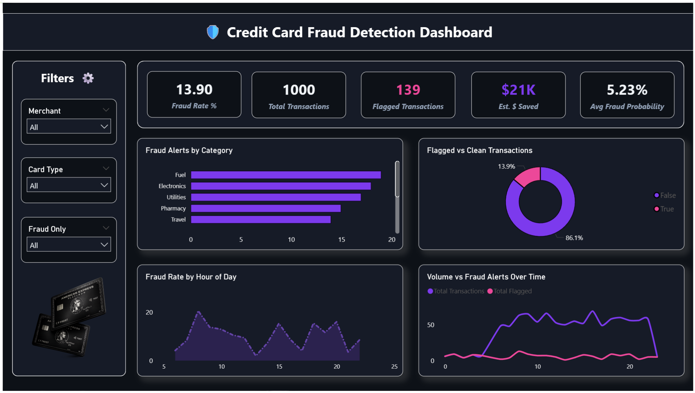
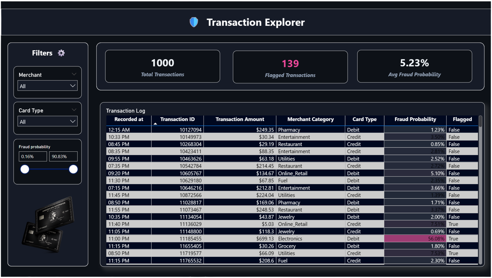
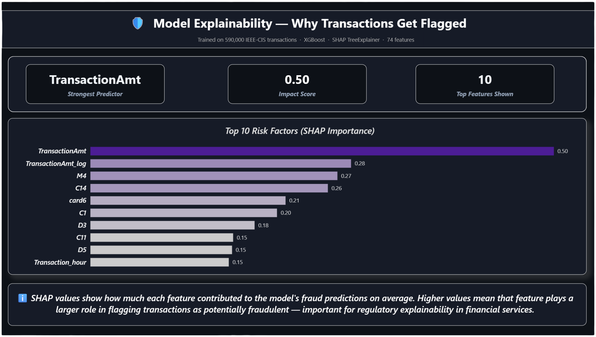

# Credit Card Fraud Detection System
### Real-Time ML Pipeline with Explainable AI and Live Power BI Dashboard



---

## Business Problem

Credit card fraud costs the global financial industry over **$32 billion annually**. Traditional rule-based detection systems generate excessive false positives, frustrating legitimate customers, while missing sophisticated fraud patterns. The challenge is building a detection system that is simultaneously accurate, explainable, and fast enough to act on transactions in near-real-time.

This project simulates the core components of an enterprise fraud detection pipeline — from ML model training to live transaction scoring to a business intelligence dashboard — using the same architectural patterns employed at financial institutions like American Express.

---

## Solution Architecture

```
IEEE-CIS Dataset (590K transactions)
        │
        ▼
┌─────────────────────────┐
│   Feature Engineering   │  Time-based split · 74 features · SMOTE oversampling
│   + XGBoost Training    │  AUC-ROC: 0.89 · PR-AUC: 0.47
│   + SHAP Explainability │  Cost-optimized threshold: 0.07
└───────────┬─────────────┘
            │  fraud_model.pkl
            ▼
┌─────────────────────────┐
│   Azure Function        │  Timer trigger every 5 minutes
│   Transaction Simulator │  Generates 15 synthetic transactions/run
│                         │  Scores each with XGBoost model
│                         │  SHAP-based reason generation per alert
└───────────┬─────────────┘
            │
            ▼
┌─────────────────────────┐
│   Supabase PostgreSQL   │  3 tables: transactions · fraud_alerts · daily_summary
│   (Cloud Database)      │  ~4,320 transactions/day · Running 24/7
└───────────┬─────────────┘
            │
            ▼
┌─────────────────────────┐
│   Power BI Dashboard    │  3 pages: Executive Overview · Transaction Explorer
│                         │           Model Explainability
└─────────────────────────┘
```

---

## Key Results

| Metric | Value |
|--------|-------|
| Dataset size | 590,000 transactions (IEEE-CIS) |
| Model | XGBoost (300 estimators) |
| AUC-ROC | 0.8899 |
| Precision-Recall AUC | 0.4708 |
| Classification threshold | 0.07 (cost-optimized) |
| Estimated cost savings vs default threshold | $169,405 (43% reduction) |
| Pipeline frequency | Every 5 minutes, 24/7 |
| Transactions processed daily | ~4,320 |

---

## Why These Technical Choices Matter

**Time-based train/test split (not random)**
Fraud patterns evolve over time. A random 80/20 split leaks future patterns into training data — an unrealistic scenario that inflates model scores. Splitting chronologically simulates real deployment: train on historical data, predict future fraud.

**SMOTE on training data only**
The IEEE-CIS dataset has ~3.5% fraud rate. Applying SMOTE only to the training set generates synthetic minority-class samples without contaminating the test set evaluation. Accuracy is a misleading metric here — a model predicting "not fraud" for everything achieves 96.5% accuracy while catching zero fraud. Precision-Recall AUC is the correct metric.

**Cost-optimized threshold tuning**
Standard classifiers use 0.5 as the decision threshold. In fraud detection, a missed fraud (false negative) costs ~$150 on average. A false positive (blocking a legitimate transaction) costs ~$5 in customer friction. The asymmetric cost justifies a lower threshold (0.07) that flags more aggressively — reducing projected business cost by 43% compared to the default.

**SHAP explainability**
Financial regulators require that institutions explain why a transaction was flagged. SHAP (SHapley Additive exPlanations) provides per-transaction explanations — "this transaction was flagged because the amount was 7x the card's average AND it occurred at 2:00 AM." This transforms the model from a black box into a defensible business tool.

---

## Dashboard Pages

### Page 1: Executive Overview
Live KPIs: fraud rate, total flagged, estimated $ saved, average fraud probability. Charts: fraud alerts by merchant category, flagged vs clean donut, fraud rate by hour of day (statistically filtered for sample size), transaction volume vs fraud alerts over time.


### Page 2: Transaction Explorer
Drill-down table of individual transactions with fraud probability scores, conditional formatting (pink highlight = above threshold), and interactive filters by merchant, card type, fraud status, and probability range slider.



### Page 3: Model Explainability
SHAP feature importance bar chart showing top 10 risk factors with a dark-to-light purple gradient. Summary cards: strongest predictor (TransactionAmt), impact score, features shown. Business-readable explanation of what SHAP values mean and why explainability matters in financial services.



---

## Tech Stack

| Layer | Tool | Purpose |
|-------|------|---------|
| ML Model | XGBoost + scikit-learn | Fraud classification |
| Imbalance handling | SMOTE (imbalanced-learn) | Minority class oversampling |
| Explainability | SHAP TreeExplainer | Per-transaction risk reasons |
| Simulation | Azure Functions (Python 3.11) | Serverless timer-triggered ETL |
| Database | Supabase PostgreSQL | Cloud storage, 3 tables |
| Dashboard | Power BI Desktop | 3-page interactive dashboard |
| Data source | IEEE-CIS Fraud Detection (Kaggle) | 590K real anonymized transactions |

---

## Database Schema

```sql
-- All scored transactions
CREATE TABLE transactions (
    id SERIAL PRIMARY KEY,
    transaction_id BIGINT,
    transaction_amt FLOAT,
    product_cd VARCHAR(10),
    card_type VARCHAR(20),
    merchant_category VARCHAR(50),
    transaction_hour FLOAT,
    fraud_probability FLOAT,
    is_flagged BOOLEAN,
    actual_fraud_pattern BOOLEAN,
    recorded_at TIMESTAMP DEFAULT NOW()
);

-- Fraud alerts with SHAP-based reasons
CREATE TABLE fraud_alerts (
    id SERIAL PRIMARY KEY,
    transaction_id BIGINT,
    transaction_amt FLOAT,
    fraud_probability FLOAT,
    merchant_category VARCHAR(50),
    top_reason VARCHAR(200),
    alert_status VARCHAR(20) DEFAULT 'New',
    recorded_at TIMESTAMP DEFAULT NOW()
);

-- Daily aggregated statistics
CREATE TABLE daily_summary (
    id SERIAL PRIMARY KEY,
    summary_date DATE DEFAULT CURRENT_DATE,
    total_transactions INT,
    total_flagged INT,
    fraud_rate FLOAT,
    avg_fraud_probability FLOAT,
    estimated_savings FLOAT,
    updated_at TIMESTAMP DEFAULT NOW()
);
```

---

## Project Structure

```
FraudProject/
├── README.md
├── architecture.png
├── dashboard-screenshots/
│   ├── page1-executive-overview.png
│   ├── page2-transaction-explorer.png
│   └── page3-model-explainability.png
├── notebooks/
│   └── 01_fraud_model_training.ipynb
├── azure-function/
│   ├── function_app.py
│   ├── requirements.txt
│   └── host.json
├── powerbi/
│   └── FraudDetectionDashboard.pbix
├── data/
│   └── shap_feature_importance.csv
└── supabase-schema.sql
```

---

## Setup & Reproduction

### 1. Train the model
```bash
cd notebooks
jupyter notebook 01_fraud_model_training.ipynb
# Requires: train_transaction.csv + train_identity.csv from Kaggle IEEE-CIS competition
# Outputs: fraud_model.pkl · model_features.pkl · optimal_threshold.pkl · category_mappings.pkl
```

### 2. Deploy Azure Function
```bash
cd azure-function
# Add to Azure Function App → Environment Variables:
# SUPABASE_CONNECTION_STRING = postgresql://...
func azure functionapp publish <your-function-app-name>
```

### 3. Open Power BI Dashboard
Open `powerbi/FraudDetectionDashboard.pbix` in Power BI Desktop.
Update the Supabase REST API URLs and anon key in Transform Data → Advanced Editor.

---

## Challenges & Solutions

| Challenge | Solution |
|-----------|----------|
| Class imbalance (3.5% fraud rate) | SMOTE on training set only + PR-AUC as primary metric |
| Categorical encoding bug in simulator | Saved training-time category mappings to `category_mappings.pkl` |
| numpy.bool_ type error in psycopg2 | Wrapped all boolean values with `bool()` before insert |
| Inflated fraud rate at low-sample hours | Visual-level filter: minimum 15 transactions per hour |
| Azure Function ManagedIdentity error | Registered `Microsoft.ManagedIdentity` namespace in subscription |
| Per-transaction SHAP reasons (generic) | Replaced heuristics with real `TreeExplainer` SHAP values per transaction |

---

## Business Recommendations

Based on the simulated pipeline data:

1. **Fuel and Electronics categories** show the highest fraud alert volume — recommend enhanced verification (CVV2 + address match) for transactions above $200 in these categories.

2. **Late-night hours (0:00–5:00)** show elevated fraud rates — consider additional authentication steps for transactions in this window, especially from new cards.

3. **Transaction amount is the strongest predictor** (SHAP = 0.50) — amounts significantly above a card's historical average are the single most reliable fraud signal. A real-time spend-velocity check would directly target this.

4. **Cost-optimized threshold (0.07 vs default 0.50)** reduces projected losses by 43% — the default threshold is too conservative for a high-cost false-negative environment like card fraud.

---

## Author

**Hitanshu Bansal**
B.Tech (IT), UIET Panjab University, Chandigarh
[LinkedIn](https://linkedin.com/in/hitanshu-bansal) · [GitHub](https://github.com/Hitanshubansal45)
